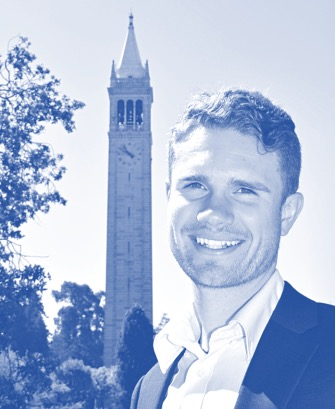

 

Welcome to the site! 

My name is Mitch and I am a PhD student at UC Berkeley studying nuclear engineering. 
Like many of the students I work with on a daily basis, I picked the nuclear field because I am incredibliy passionate about sustainability. 
As the global human population growns and energy demand increases, finding clean energy sources to meet the needs of modern civilization in an economically feasible and environmentally just way is going to become a critical need.
I believe that harnessing the energy contained in the nuclei all around us offers our best shot at achieving a clean energy future.

While simulating nuclear physics on some massive supercomputers is my day job, I've discovered a number of other things I'm passionate about here at Berkeley. 
More and more I see the importance of communication between scientists and the community at large about how, and especially _why_, they are doing research. 
That realization has inspired me to join in scientific outreach initiatives, get unreasonably thrilled about conducting research in an open and reproducible way, and even find a love for teaching. 
I guess it's also part of why you're reading this now; without it this page wouldn't exist.

My hope is that by sharing what I learn here, I can help you learn something too. My only request is that you keep the trend going, and always be willing to share what you learn with others. Good luck!

<a href="https://github.com/mitchnegus">Github</a> | 
<a href="https://www.linkedin.com/in/mitchnegus">LinkedIn</a> |
<a href="https://twitter.com/mitchnegus">Twitter</a>

